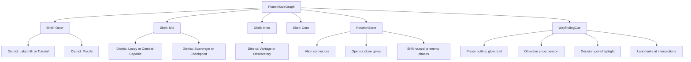
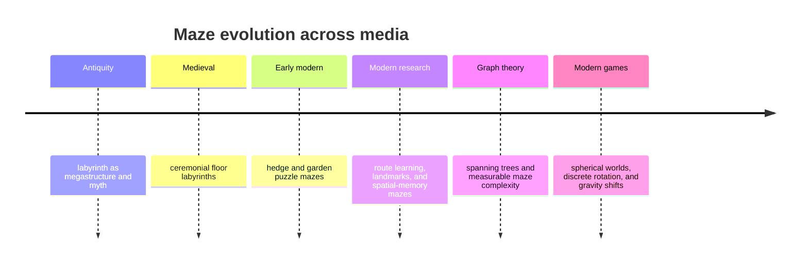

# Master Mazes Across Media

Status: future-facing research synthesis. This document does not change current repo truth, current runtime code, or the shipping baseline.

Related docs:
- `docs/research/MAZER_ROTATING_PLANET_MAZE_MASTER_PLAN.md`
- `docs/research/MAZER_MAZE_INSPIRATION_ATLAS.md`
- `docs/roadmap.md`

## Purpose

Capture durable lessons from heritage labyrinths, garden mazes, spatial puzzle games, wayfinding research, and maze-generation literature that can inform a future graph-first rotating planet maze with discrete shells, scarce shell transitions, and learnable rotation.

This brief is intentionally future-facing. It exists to sharpen the later concept lane without re-scoping the current ambient 2D Mazer build. The deferred sequence remains fixed: design brief, topology sandbox, isolated 3D prototype, then a later integration decision.

Where this document goes beyond a single source, it does so as a synthesis across the sources listed at the end.

## Executive Summary

Master mazes are not defined by raw complexity alone. They work because they repeatedly convert:
- orientation
- confusion
- insight
- progress
- payoff

The oldest distinction still matters. The [Chartres cathedral labyrinth](https://www.cathedrale-chartres.org/en/cathedrale/monument/the-labyrinth/) represents the unicursal tradition: one route, strong procession, and a meaningful center. The [Hampton Court Maze](https://www.hrp.org.uk/hampton-court-palace/whats-on/the-maze/) represents the multicursal tradition: branching choices, dead ends, and deliberate wrong turns.

Across those physical precedents and modern games such as [Super Mario Galaxy](https://iwataasks.nintendo.com/interviews/wii/super_mario_galaxy/1/1/), [FEZ](https://store.steampowered.com/app/224760/FEZ/), [Manifold Garden](https://manifold.garden/walkthrough), [Antichamber](https://store.steampowered.com/app/219890/Antichamber/), and [Mirror's Edge Catalyst's Runner's Vision](https://www.ea.com/news/runners-vision-in-mirrors-edge-catalyst), the strongest recurring rules are:

- design the maze as topology first and spectacle second
- make reconfiguration discrete and learnable instead of free-form and opaque
- treat landmarks, player visibility, and decision-point guidance as core systems
- vary district signatures so the maze does not collapse into one long samey navigation grind

For Mazer's future planet-maze lane, the strongest synthesis remains:
1. represent the planet as a graph before rendering it as a place
2. use a surface-first concentric-shell structure with scarce shell transitions
3. make rotation a discrete topology operator with readable before-and-after consequences
4. require landmarks, cueing, and contrast so clarity returns at the moments that matter

The current roadmap already keeps that lane deferred behind ambient stabilization and packaging. This brief supports that decision rather than changing it.

## Why This Matters To Mazer

Mazer today is still:
- an ambient-first product
- a 2D build
- governed by screenshot-gated visual truth plus `docs/current-truth.md`
- based on Wilson-preserving maze generation in the shipping line

That matters because the future rotating-planet lane should not inherit accidental assumptions from the ambient build. Its rules should be justified by topology, wayfinding, and readability from the start.

## Canonical Exemplars

| Example | Medium | What it proves |
| --- | --- | --- |
| [Chartres cathedral labyrinth](https://www.cathedrale-chartres.org/en/cathedrale/monument/the-labyrinth/) | cathedral floor labyrinth | A single-route form can still feel masterful when the path has ceremony and the center matters. |
| [Hampton Court Maze](https://www.hrp.org.uk/hampton-court-palace/whats-on/the-maze/) | hedge puzzle maze | Multicursal design turns dead ends and wrong turns into the main teaching mechanism. |
| [Longleat Hedge Maze](https://www.longleat.co.uk/latest-news/2025/a-walk-through-history) | tourist-scale hedge maze | Maze scale is memorable when it is framed as a bounded attraction rather than an endless burden. |
| [Villa Pisani park itinerary](https://villapisani.beniculturali.it/visite-e-itinerari/itinerari-parco) | historic formal garden labyrinth | Named garden landmarks and formal spatial hierarchy remain useful mental models for future re-orientation spaces. |
| [Super Mario Galaxy](https://iwataasks.nintendo.com/interviews/wii/super_mario_galaxy/1/1/) | spherical 3D traversal game | A world that reads as a whole object can reduce "where do I go?" confusion instead of increasing it. |
| [FEZ](https://store.steampowered.com/app/224760/FEZ/) | perspective-rotation puzzle game | Discrete perspective states are easier to learn than continuous free-spin. |
| [Manifold Garden](https://manifold.garden/walkthrough) | gravity-shift puzzle game | Radical orientation shifts stay playable when the next state is strongly telegraphed by color and preview cues. |
| [Antichamber](https://store.steampowered.com/app/219890/Antichamber/) | non-Euclidean exploration game | Strange space still needs stable learnable rules or it stops feeling fair. |
| [Mirror's Edge Catalyst: Runner's Vision](https://www.ea.com/news/runners-vision-in-mirrors-edge-catalyst) | diegetic guidance system | Selective in-world guidance scales better than permanent HUD clutter in complex spaces. |
| [Portal postmortem](https://cdn.cloudflare.steamstatic.com/apps/valve/2008/GDC2008_PortalPostMortem.pdf) | puzzle design postmortem | Puzzle challenge should come from reasoning, not from hiding the currently relevant state. |
| [Spherical Maze Generation](https://www.cs.umd.edu/~mount/Indep/Xue-Li/xue-scholarly-paper.pdf) | spherical maze paper | Planet mazes are easiest to reason about when built from sphere topology first, then carved and rendered. |
| [Generating Random Spanning Trees](https://research.google/pubs/generating-random-spanning-trees/) and [Wilson 1996](https://dblp.org/rec/conf/stoc/Wilson96) | graph and sampling literature | Perfect-maze behavior is best understood as a spanning-tree problem, not as a cosmetic wall layout. |
| [The Complexity and Difficulty of a Maze](https://archive.bridgesmathart.org/2001/bridges2001-213.pdf) | mathematics and maze analysis | Difficulty can be measured through graph and hallway structure rather than guessed by size alone. |
| [Virtual navigation landmark study](https://www.frontiersin.org/articles/10.3389/fnagi.2016.00122/full) | route-learning research | Landmarks placed at decision points matter more than equally distinctive features placed on straightaways. |

## Recurring Archetypes

### Unicursal And Near-Unicursal

Best for:
- onboarding
- ceremony
- inevitability
- meaningful arrivals

Why it matters:
- a maze does not need many choices to feel important
- clear pacing can substitute for branching density in early districts
- the outer shell tutorial should borrow from procession rather than from punishment

### Multicursal Puzzle Mazes

Best for:
- wrong-turn learning
- route planning
- memory pressure
- local uncertainty with meaningful consequences

Why it matters:
- branching is most useful when mistakes teach structure instead of merely wasting time
- dead ends should be treated as a pacing budget, not residue from a generator

### Loopy Or Braided Spaces

Best for:
- pursuit and escape
- recovery after mistakes
- flanking, rerouting, and hazard play

Why it matters:
- loops reduce the all-or-nothing punishment of perfect mazes
- combat-capable districts need alternate circulation before they need more enemy types

### Scavenger Or Station-Based Mazes

Best for:
- bounded regional goals
- checkpoint rhythm
- turning one large maze into several finishable sub-problems

Why it matters:
- "find the exit" cannot be the only verb in a long-form planet maze
- local objectives make progress legible even when the full structure is large

### Vantage-Based Districts

Best for:
- re-orientation
- dramatic reveals
- refreshing the player's mental map before deeper escalation

Why it matters:
- a good maze intentionally schedules recovery
- observatories, towers, balconies, and exposed ring paths should work as earned clarity beats

## Topology First

The most reliable mental model is to treat a maze as a graph before treating it as a place.

That means defining:
- nodes and edge relationships
- shell transitions
- rotation states
- junction significance
- loop budgets
- landmark placement
- goal and checkpoint spacing

before deciding:
- wall dressing
- camera spectacle
- lighting
- decorative shell geometry

The [Spherical Maze Generation](https://www.cs.umd.edu/~mount/Indep/Xue-Li/xue-scholarly-paper.pdf) paper is especially useful here because it starts from uniformly distributed points on a sphere, builds triangulation and Voronoi adjacency, and only then removes walls with union-find to create connected circulation. That is the right mental order for a future planet maze.

The [Bridges maze-complexity paper](https://archive.bridgesmathart.org/2001/bridges2001-213.pdf) is useful for the same reason: it explicitly maps a maze to a graph and then measures hallway complexity and overall difficulty from the resulting structure.

## District Signatures Before Art Direction

The future planet should not be "one giant maze." It should be a set of districts with different topology signatures that the player can feel before they fully understand them.

Useful district differences:
- low-junction ceremonial routes versus high-junction puzzle routes
- sparse loops versus dense loops
- scarce shell connectors versus high local circulation
- long corridor commitments versus short local decisions
- hidden endpoints versus visible checkpoint proxies

A future district is successful when the player can say what kind of place it is before they can solve it.

## Generation Families And Their Signatures

| Generator family | Typical signature | Best use in the future lane |
| --- | --- | --- |
| randomized DFS / recursive backtracker | long corridor commitments and strong backtracking pressure | puzzle districts that should feel deep and committed |
| randomized Prim-style growth | more local decisions and more even branching | scavenger or mixed puzzle districts |
| recursive division | strong macro partitions and architectural readability | outer-shell readability zones and formal districts |
| Wilson or Aldous-Broder uniform spanning tree methods | cleaner "perfect maze" baselines on arbitrary graphs | shell generation on irregular spherical graphs |
| braid / loop insertion passes | recovery routes and less punitive dead-end density | combat-capable or chase-capable districts |
| spherical Voronoi plus union-find carving | graph-first planet surface generation without latitude distortion | the core planet substrate for shell graphs |

Important rule:
- do not ask one generator family to do every job
- pick a family because its structural signature matches the district's intended feel
- use post-processing deliberately instead of hiding the signature under art

## Metrics Worth Tracking

Size alone is a poor proxy for difficulty.

For the future topology sandbox, the most useful measurement set is:
- solution length
- dead-end count
- junction count and degree histogram
- corridor run length
- straightness and turn density
- loop count
- branch density
- shell transition count
- portal density
- landmark spacing
- checkpoint spacing
- objective visibility uptime
- vantage frequency

These metrics matter because they let the team reject layouts that are merely large, noisy, or visually impressive without being readable or intentionally difficult.

The future contracts already point in the right direction:
- `PlanetMazeGraph` for adjacency truth
- `PlanetDistrict` for district-level intent
- `RotationState` for explicit reconfiguration rules
- `WayfindingCue` for in-world guidance
- `PlanetMazeMetrics` for measurement and rejection criteria

## 3D, Multi-Layer, And Rotation-Specific Lessons

### Spheres Help When The Whole Object Reads

[Super Mario Galaxy](https://iwataasks.nintendo.com/interviews/wii/super_mario_galaxy/1/1/) is a useful precedent because the spherical form is not only a visual gimmick. The world shape itself becomes a navigation aid. Players can understand the object they are moving across.

For Mazer, that means:
- the planet should be legible as a whole object from normal play
- players should build a mental model from surface exposure before they descend inward
- windows, exposed rings, and observatories should preview deeper shells before entry

### Rotation Works Best As A Discrete Operator

[FEZ](https://store.steampowered.com/app/224760/FEZ/) and [Manifold Garden](https://manifold.garden/walkthrough) both support the same rule: radical spatial change stays playable when the next state is bounded, previewed, and nameable.

Rotation should therefore:
- align or misalign connectors
- open or close gates
- shift hazard or enemy phases
- expose new sightlines

Rotation should not default to:
- analog free-spin
- camera-heavy explanation of topology
- outcomes the player cannot predict from world cues

### Multi-Layer Mazes Need Scarce Connectors

Shell transitions should be rare, memorable, and landmarked.

If too many shell connectors are available at once:
- the player's mental model collapses
- the current shell stops feeling like a place
- deeper shells stop feeling earned

The correct pattern is:
- teach the outer shell first
- reveal the existence of deeper shells early
- unlock actual traversal later through specific connectors, gates, or aligned openings

## Wayfinding And Perceptual Legibility

Many maze failures are not topological failures. They are perceptual failures.

Common failure modes:
- the player marker is weaker than the wall detail
- every wall and surface has equal visual weight
- the objective exists but is visually subordinate to background noise
- landmarks are decorative instead of decision-relevant

The [Frontiers virtual-maze study](https://www.frontiersin.org/articles/10.3389/fnagi.2016.00122/full) is useful because it treats landmarks at intersections as critical cues and distinguishes them from non-decision-point cues on straight segments. That is exactly the distinction a future planet maze needs.

The [W3C contrast guidance for text](https://www.w3.org/WAI/WCAG21/Understanding/contrast-minimum) and [non-text UI contrast](https://www.w3.org/WAI/WCAG22/Understanding/non-text-contrast.html) reinforces the same practical rule for game presentation: if the player, connectors, and objective proxies are not the strongest local signals, navigation quality drops for the wrong reason.

Practical future rules:
- keep the player silhouette dominant with outline, glow, and minimum apparent size
- place distinct landmarks at intersections, gates, and shell hubs
- suppress decorative clutter around current decisions
- use a focus mode or equivalent temporary cue boost if the scene gets crowded

## Diegetic Guidance Beats Heavy HUD

[Runner's Vision](https://www.ea.com/news/runners-vision-in-mirrors-edge-catalyst) is a strong example because it highlights only what matters now and allows guidance strength to vary.

That pattern maps cleanly to a future planet maze:
- current junction emphasis
- current objective proxy
- current shell connector emphasis after rotation
- optional short-lived route reassurance after a major state change

Avoid:
- permanent paint across the whole route
- stacked icons for every connector or collectible
- HUD solving the maze for the player

## Enemies, Hazards, And Puzzles Must Bind To Topology

The future planet should not treat enemies, hazards, and puzzles as generic noise laid on top of navigation.

Better patterns:
- enemy turns happen at junctions, not at arbitrary points in open space
- loops support pursuit, escape, and recovery, not just visual variation
- checkpoint districts use bounded goals rather than endless wandering
- puzzle state stays visible or is replaced by a clear proxy when the true object is offscreen

The [Portal postmortem](https://cdn.cloudflare.steamstatic.com/apps/valve/2008/GDC2008_PortalPostMortem.pdf) remains the clearest anchor for this rule. Good puzzle difficulty comes from reasoning over visible state, not from hidden dependencies.

## Recommended Future Implementation Order

The current roadmap's staging order is still correct:
1. design brief
2. topology sandbox
3. isolated 3D prototype
4. later integration decision

That order is justified by the synthesis above.

### Option A: Readability Upgrade In The Current 2D Product

Scope:
- stronger player cueing
- reduced crowding
- better decision-point emphasis
- optional focus mode

Value:
- fastest way to reduce visual-search failure in the shipping product

Limit:
- does not prove a 3D planet maze

### Option B: Topology Sandbox

Scope:
- graph-only shell generation
- district signatures
- loop and dead-end budgets
- landmark placement rules
- rotation-state validation
- metrics reporting

Value:
- proves the future lane's structure before expensive rendering or engine choices

### Option C: Isolated 3D Outer-Shell Prototype

Scope:
- one shell
- a small set of discrete rotation states
- one or two district types
- one observatory or equivalent recovery node
- strong player and objective cues

Value:
- proves camera clarity, orientation recovery, and shell readability early

### Option D: Multi-Shell Production Slice

Scope:
- multiple shells
- district variety
- scarce shell transitions
- rotation-state gating
- topology-bound enemies or hazards

Value:
- closest proof of the final fantasy

Risk:
- too expensive to attempt before topology and readability gates pass

## Mermaid: System Relationship Sketch

## Mermaid: Medium Evolution Sketch

## Scope Boundary

This document does not:
- change current product truth
- replace the existing ambient Phaser build
- pick a 3D engine
- authorize runtime code changes
- move the rotating-planet lane ahead of the roadmap's current staging

## Sources

- [The labyrinth of Chartres cathedral](https://www.cathedrale-chartres.org/en/cathedrale/monument/the-labyrinth/)
- [The Maze | Hampton Court Palace | Historic Royal Palaces](https://www.hrp.org.uk/hampton-court-palace/whats-on/the-maze/)
- [A walk through history | Longleat](https://www.longleat.co.uk/latest-news/2025/a-walk-through-history)
- [Itinerari in Parco | Villa Pisani Museo Nazionale](https://villapisani.beniculturali.it/visite-e-itinerari/itinerari-parco)
- [Iwata Asks: Super Mario Galaxy - Volume 2, Page 2](https://iwataasks.nintendo.com/interviews/wii/super_mario_galaxy/1/1/)
- [Iwata Asks: Super Mario Galaxy 2 - Volume 1, Page 1](https://iwataasks.nintendo.com/interviews/wii/supermariogalaxy2/0/0/)
- [FEZ on Steam](https://store.steampowered.com/app/224760/FEZ/)
- [Manifold Garden walkthrough](https://manifold.garden/walkthrough)
- [Antichamber on Steam](https://store.steampowered.com/app/219890/Antichamber/)
- [FOLLOW THE RED: RUNNER'S VISION IN MIRROR'S EDGE CATALYST](https://www.ea.com/news/runners-vision-in-mirrors-edge-catalyst)
- [Portal postmortem PDF](https://cdn.cloudflare.steamstatic.com/apps/valve/2008/GDC2008_PortalPostMortem.pdf)
- [Spherical Maze Generation](https://www.cs.umd.edu/~mount/Indep/Xue-Li/xue-scholarly-paper.pdf)
- [Generating Random Spanning Trees](https://research.google/pubs/generating-random-spanning-trees/)
- [Generating random spanning trees more quickly than the cover time](https://dblp.org/rec/conf/stoc/Wilson96)
- [The Complexity and Difficulty of a Maze](https://archive.bridgesmathart.org/2001/bridges2001-213.pdf)
- [Age-Related Differences in Associative Learning of Landmarks and Heading Directions in a Virtual Navigation Task](https://www.frontiersin.org/articles/10.3389/fnagi.2016.00122/full)
- [Understanding SC 1.4.3: Contrast (Minimum)](https://www.w3.org/WAI/WCAG21/Understanding/contrast-minimum)
- [Understanding SC 1.4.11: Non-text Contrast](https://www.w3.org/WAI/WCAG22/Understanding/non-text-contrast.html)
